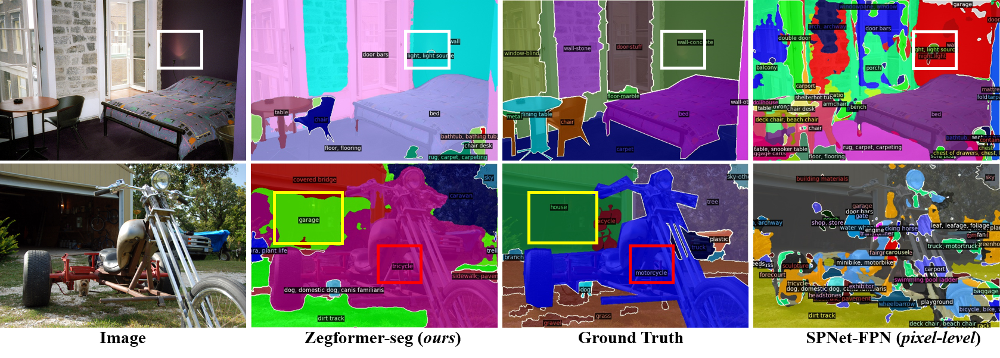

# Multi-domain Evaluation of Semantic Segmentation (MESS) with SAN

[[Website](https://github.io)] [[arXiv](https://arxiv.org/)] [[GitHub](https://github.com/blumenstiel/MESS)]

This directory contains the code for the MESS evaluation of SAN. Please see the commits for our changes of the model.

## Setup
Create a conda environment `san` and install the required packages. See [mess/README.md]([mess/README.md]) for details.
```sh
 bash mess/setup_env.sh
```

Prepare the datasets by following the instructions in [mess/DATASETS.md](mess/DATASETS.md). The `san` env can be used for the dataset preparation. If you evaluate multiple models with MESS, you can change the `dataset_dir` argument and the `DETECTRON2_DATASETS` environment variable to a common directory (see [mess/DATASETS.md](mess/DATASETS.md) and [mess/eval.sh](mess/eval.sh)). 

Download the SAN weights with
```sh
mkdir weights
wget https://huggingface.co/Mendel192/san/resolve/main/san_vit_b_16.pth -O weights/san_vit_b_16.pth
wget https://huggingface.co/Mendel192/san/resolve/main/san_vit_large_14.pth -O weights/san_vit_large_14.pth
```

## Evaluation
To evaluate the SAN models on the MESS dataset, run
```sh
bash mess/eval.sh

# for evaluation in the background:
nohup bash mess/eval.sh > eval.log &
tail -f eval.log 
```

For evaluating a single dataset, select the DATASET from [mess/DATASETS.md](mess/DATASETS.md), the DETECTRON2_DATASETS path, and run
```
conda activate san
export DETECTRON2_DATASETS="datasets"
DATASET=<dataset_name>

# Base model
python train_net.py --eval-only --num-gpus 1 --config-file configs/san_clip_vit_res4_coco.yaml OUTPUT_DIR output/SAN_base/$DATASET MODEL.WEIGHTS weights/san_vit_b_16.pth DATASETS.TEST \(\"$DATASET\",\)
# Large model
python train_net.py --eval-only --num-gpus 1 --config-file configs/san_clip_vit_large_res4_coco.yaml OUTPUT_DIR output/SAN_large/$DATASET MODEL.WEIGHTS weights/san_vit_large_14.pth DATASETS.TEST \(\"$DATASET\",\)
```

# --- Original SAN README.md ---

# Decoupling Zero-Shot Semantic Segmentation
This is the official code for the [ZegFormer](https://arxiv.org/abs/2112.07910) (CVPR 2022).

ZegFormer is the first framework that decouple the zero-shot semantic segmentation into: 1) class-agnostic segmentation and 2) segment-level zero-shot classification

[comment]: <> (![fig1]&#40;figures/fig1.png&#41;)
### Visualization of semantic segmentation with open vocabularies
ZegFormer is able to segment stuff and things with open vocabularies. The predicted classes can be more fine-grained 
than the COCO-Stuff annotations (see colored boxes below).

[comment]: <> (The unannotated vocabularies in COCO-Stuff can also be segmented by ZegFormer.&#41;)


[comment]: <> (### Benchmark Results)

### Data Preparation
See [data preparation](datasets/README.md)

### Config files
For each model, there are two kinds of config files. The file without suffix "_gzss_eval" is used for training. The file with suffix "_gzss_eval" 
is used for generalized zero-shot semantic segmentation evaluation.

### Inference Demo with Pre-trained Models
Download the checkpoints of ZegFormer from https://drive.google.com/drive/u/0/folders/1qcIe2mE1VRU1apihsao4XvANJgU5lYgm
```
python demo/demo.py --config-file configs/coco-stuff/zegformer_R101_bs32_60k_vit16_coco-stuff_gzss_eval.yaml \
  --input input1.jpg input2.jpg \
  [--other-options]
  --opts MODEL.WEIGHTS /path/to/zegformer_R101_bs32_60k_vit16_coco-stuff.pth
```
The configs are made for training, therefore we need to specify `MODEL.WEIGHTS` to a model from model zoo for evaluation.
This command will run the inference and show visualizations in an OpenCV window.

For details of the command line arguments, see `demo.py -h` or look at its source code
to understand its behavior. Some common arguments are:
* To run __on your webcam__, replace `--input files` with `--webcam`.
* To run __on a video__, replace `--input files` with `--video-input video.mp4`.
* To run __on cpu__, add `MODEL.DEVICE cpu` after `--opts`.
* To save outputs to a directory (for images) or a file (for webcam or video), use `--output`.

#### Inference with more classnames

In the example above, the model is trained with __156 classes__, and inferenced with __171 classes__.

If you want to inference with more classes, try the config `zegformer_R101_bs32_60k_vit16_coco-stuff_gzss_eval_847_classes.yaml`. 

[comment]: <> (You can also generate your customized json __TEST_CLASS_JSON with arbitrary class names__ by yourself.)


### Training & Evaluation in Command Line
To train models with R-101 backbone, download the pre-trained model
 [R-101.pkl](https://dl.fbaipublicfiles.com/detectron2/ImageNetPretrained/MSRA/R-101.pkl), which is a converted copy of [MSRA's original ResNet-101](https://github.com/KaimingHe/deep-residual-networks) model.


We provide two scripts in `train_net.py`, that are made to train all the configs provided in MaskFormer.

To train a model with "train_net.py", first
setup the corresponding datasets following
[datasets/README.md](./datasets/README.md),
then run:
```
./train_net.py --num-gpus 8 \
  --config-file configs/coco-stuff/zegformer_R101_bs32_60k_vit16_coco-stuff.yaml
```

The configs are made for 8-GPU training.
Since we use ADAMW optimizer, it is not clear how to scale learning rate with batch size.
To train on 1 GPU, you need to figure out learning rate and batch size by yourself:
```
./train_net.py \
  --config-file configs/coco-stuff/zegformer_R101_bs32_60k_vit16_coco-stuff.yaml \
  --num-gpus 1 SOLVER.IMS_PER_BATCH SET_TO_SOME_REASONABLE_VALUE SOLVER.BASE_LR SET_TO_SOME_REASONABLE_VALUE
```

To evaluate a model's performance, use
```
./train_net.py \
  --config-file configs/coco-stuff/zegformer_R101_bs32_60k_vit16_coco-stuff_gzss_eval.yaml \
  --eval-only MODEL.WEIGHTS /path/to/checkpoint_file
```
For more options, see `./train_net.py -h`.

The pre-trained checkpoints of ZegFormer can be downloaded from https://drive.google.com/drive/folders/1qcIe2mE1VRU1apihsao4XvANJgU5lYgm?usp=sharing

## Disclaimer
Although the reported results on PASCAL VOC are trained with 10k iterations, the results at 10k are not stable. We recommend to train models with longer iterations.
## Acknowlegment
This repo benefits from [CLIP](https://github.com/openai/CLIP) and [MaskFormer](https://github.com/facebookresearch/MaskFormer). Thanks for their wonderful works.

## Citation
``` 
@article{ding2021decoupling,
  title={Decoupling Zero-Shot Semantic Segmentation},
  author={Ding, Jian and Xue, Nan and Xia, Gui-Song and Dai, Dengxin},
  booktitle={Proceedings of the IEEE Conference on Computer Vision and Pattern Recognition (CVPR)},
  year={2022}
}
```

If you have any problems in using this code, please contact me (jian.ding@whu.edu.cn)
